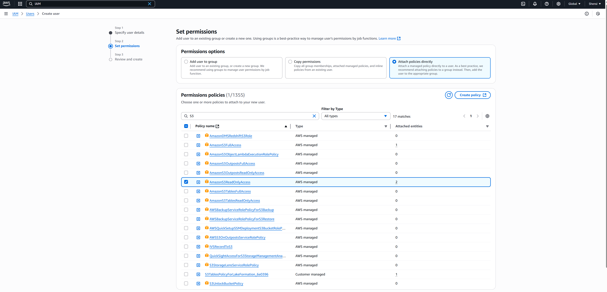
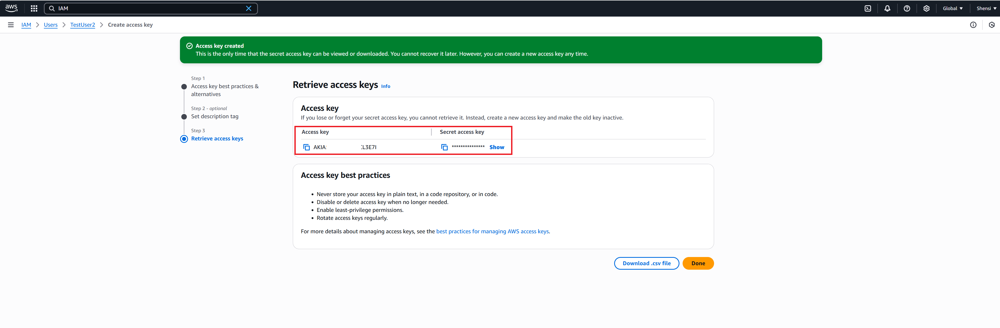

--- 
title: "Amazon S3 Microsoft 365 Copilot connector" 
ms.author: kailiang
author: Kai-Cloud
manager: zezhangzhao
audience: Admin
ms.audience: Admin 
ms.topic: article 
ms.service: mssearch 
ms.localizationpriority: medium 
search.appverid: 
description: "Set up the Amazon S3 Microsoft 365 Copilot connector." 
ms.date: 05/12/2025
---

# Amazon S3 Microsoft 365 Copilot connector

The Amazon S3 Microsoft 365 Copilot connector allows your organization to index objects stored in your Amazon S3 buckets. After you configure the connector and index content from S3, users can search for those items in Microsoft 365 Copilot.

This article is for Microsoft 365 administrators or anyone who configures, runs, and monitors the Amazon S3 Copilot connector.

## Capabilities
- Index objects (documents, files, etc.) stored in Amazon S3 buckets.
- Enable your users to ask for insights based on the content stored in S3. For example, you configured the connector to access a bucket containing onboarding documentation for sales managers at the company, Contoso:
   - What is the Code of Conduct of Contoso?
   - Summarize the Non-Disclosure Agreement (NDA) between Suntech and Contoso.
   - Extract key insights from the Contoso 2022 Electronics Sales Figures.
- Supported file types
   - Microsoft Office files (.DOC, .DOCX, .PPT, .PPTX, .XLS, .XLSX, and etc.)
   - OpenDocument files (.ODP, .ODS, .ODT, and etc.)
   - Text-based files (.CSV, .HTML, .TXT, .XML, and etc.)
   - Adobe files (.PDF)
   - Email files (.EML, .MSG, and etc.)
   - Image files (.GIF, .JPG, .JPEG, .PNG)
   - Archive files (.ZIP)
## Limitations
- Only supports indexed files in 'General purpose buckets'.
- Doesn't support only indexed files in storage classes 'Glacier Flexible Retrieval' and 'Glacier Deep Archive'.
- Doesn't index files larger than 20 MB.
- Doesn't support versioned objects (only the latest version is indexed).
- Restricted file types - only metadata is indexed (filename, extension, author, size, last modified)
   - Other files (audio, video, and etc.)

## Prerequisites
To connect to your Amazon S3 bucket, you need:
- The search admin for your organization's Microsoft 365 tenant.
- AWS (Amazon Web Service) Access Key ID and Secret Access Key with read permission to the S3 bucket.

## Get started

### Choose a display name 
The display name is used to identify each citation in Copilot to help users easily recognize the associated file or item. The display name also signifies trusted content and is used as a [content source filter](/MicrosoftSearch/custom-filters#content-source-filters).

A default value is provided; you can customize it to a name that users in your organization recognize.

### Configure AWS credentials
To connect to your S3 bucket, you need to provide AWS credentials. It's recommended to create a dedicated IAM (Identity and Access Management) user with "AmazonS3ReadOnlyAccess" permissions for security best practices.

1. Create an IAM user in your AWS account.
2. Attach the "AmazonS3ReadOnlyAccess" permissions policy.

   

3. Generate an access key ID and secret access key.

   

4. Copy these credentials to use in the connector setup.

### Authenticate and authorize
Paste your AWS access key ID and secret access key in the connector setup. Choose **Authorize**, and the connector validates that the credentials have proper permissions to access the bucket.

### Roll out to a limited audience
Deploy the connection to a limited user base if you want to validate it in Copilot and other Search surfaces before you roll it out to a broader audience. For more information, see [Staged rollout for connectors](staged-rollout-for-graph-connectors.md).

At this point, you're ready to create the connection for Amazon S3. Choose **Create** to publish your connection and begin indexing objects from your S3 bucket.

## Custom setup

In custom setup, you can edit any of the default values for users, content, and sync.

### Users
#### Access permissions

Currently, the Amazon S3 connector only supports permissions visible to Everyone due to API restrictions. All content indexed using the Amazon S3 connector is visible to Microsoft 365 users.

### Content

#### Preview data
Use the preview results button to verify the data retrieved by this connection.

#### Content Filter
The connector provides a content filter to determine which content gets indexed. You can select specific buckets to include by using the bucket name filter.

#### Manage properties

To view available properties from your S3 objects, assign a schema to the property (define whether a property is searchable, queryable, retrievable, or refinable), change the semantic label, and add an alias in the property. Some properties are selected by default.

| Default properties | Semantic label | Description | Schema |
|------------------|-------------------|----------------|------------|
| BucketName | N/A | Name of the S3 bucket containing the object | Query, Retrieve, Search |
| Content | CONTENT | Full text content of the object | Search |
| ETag | N/A | Entity tag for object version identification | N/A |
| FileExtension | File extension | File type extension | Query, Refine, Retrieve |
| IconUrl | IconUrl | URL to the icon representing the file type | Query, Retrieve, Search |
| Id | N/A | Unique identifier for the object | N/A |
| LastModified | Last modified date time | Timestamp when object was last modified | Query, Refine, Retrieve |
| Name | File name | Name of the object in S3 | N/A |
| Owner | Created by | AWS account that owns the object | N/A |
| Size | N/A | Size of the object in bytes | N/A |
| StorageClass | N/A | S3 storage class for the object | N/A |
| Url | url | Direct URL to access the object | Retrieve, Search |

### Sync

The refresh interval determines how often your data is synced between the data source and the Amazon S3 Copilot connector index. The Amazon S3 Copilot connector only supports the refresh interval - full crawl. For more information, see [refresh settings](configure-connector.md#guidelines-for-sync-settings).

You can change the default values of the refresh interval.

## Next steps
After you publish your connection, you can review the status under **Your connections** in the [admin center](https://admin.microsoft.com). To learn how to make updates and deletions, see [Manage your connector](manage-connector.md).

If you have issues or want to provide feedback, see [Microsoft Graph support](https://developer.microsoft.com/en-us/graph/support).
