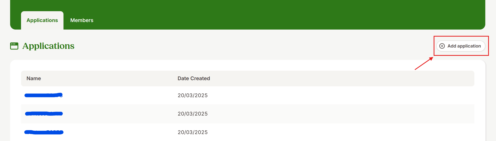
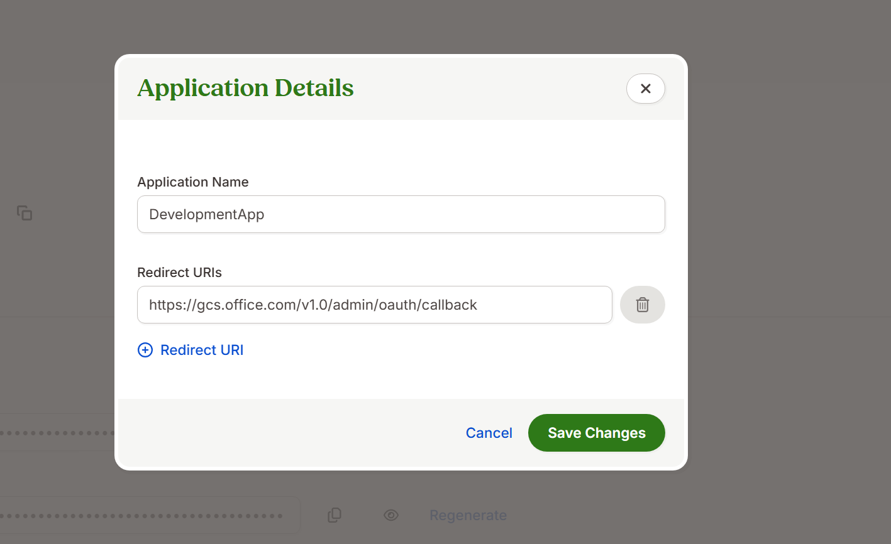

# BambooHR Microsoft 365 Copilot connector (preview)

The [Microsoft 365 Copilot connector for people data](/graph/peopleconnectors) allows organizations to index data from third-party systems into Microsoft 365. BambooHR is one of these third-party systems. 

The BambooHR Microsoft 365 Copilot connector allows organizations to index profiles from BambooHR into Microsoft Graph, making them accessible across Microsoft 365 experiences, including Microsoft 365 Copilot. 

This guide is for Microsoft 365 administrators or anyone responsible for configuring, managing, and monitoring the BambooHR Copilot connector. 

## Capabilities

- Index profile information from BambooHR.
- Enable your end users to ask questions related to BambooHR profiles. 
- Use [Semantic search](semantic-index-for-copilot.md) in Copilot to enable users to find relevant profiles based on keywords, personal preferences, and social connections. 

For more information, see [Microsoft 365 Copilot connector for people data](/graph/peopleconnectors).

## Limitations

- Time off, documents, benefits, trainings, assets, notes, emergency, onboarding, offboarding, and custom properties aren't indexable.  

## Prerequisites

1. Set up the application on the BambooHR developer portal.
1. Configure a BambooHR app with a unique App name.
   
   
   
1. Add direct URLs into the **redirect URLs** field in the app details section.  
   For Microsoft 365 Enterprise, copy and paste: `https://gcs.office.com/v1.0/admin/oauth/callback`
   
     

   
   
1. On the application scopes field, select the following scopes with read access only:  

   | Category         | Required scopes                                                                                                                                          |
   |: ---------------- |: -------------------------------------------------------------------------------------------------------------------------------------------------------- |
   | Claims         | email openid                                                                                                                                          |
   | Employee     | employee employee:contact employee:identification employee:job employee:management employee:name employee_directory sensitive_employee:protected_info |
   | Miscellaneous| field offline_access public.user                                                                                                                   |
   | Reports      | report                                                                                                                                                   |
   
   :::image type="content" source="media/bamboohr-connector/bamboohr-select-scopes.png" alt-text="Screenshot of Select Scopes." lightbox="media/bamboohr-connector/bamboohr-select-scopes.png":::
   
   
   
1. Navigate to the **app credentials** to get the App client ID and App client secret.
   
   :::image type="content" source="media/bamboohr-connector/bamboohr-client-id-and-secret.png" alt-text="Screenshot of Client Id and Client Secret Section." lightbox="media/bamboohr-connector/bamboohr-client-id-and-secret.png":::

## Get started

[Add BambooHR Microsoft 365 Copilot connector.](https://admin.microsoft.com/adminportal/home?#/MicrosoftSearch/Connectors/add)

:::image type="content" source="media/bamboohr-connector/bamboohr-add-connector.png" alt-text="Screenshot of Adding BambooHR Microsoft 365 Copilot connector from the Catalogue." lightbox="media/bamboohr-connector/bamboohr-add-connector.png":::

### 1. Choose a display name

Choose a display name, for example, BambooHR Profiles, that helps users easily recognize associated profiles in a Copilot response.

### 2. Add the instance URL

Enter your BambooHR instance URL, for example, https://contoso.bamboohr.com/ 

### 3. Choose authentication type

Select OAuth 2.0 from the list of authentication types, and enter the client ID and client secret from the BambooHR App portal.

For other settings, like access permissions, data inclusion rules, schema, crawl frequency, etc., we set defaults based on what works best with data in BambooHR. The default value settings are as follows.

|Page|Settings|Default values|
| :--- | :--- | :--- |
|Users | Access Permissions    _Note: All data retrieved through the BambooHR Copilot connector is visible to everyone in your Microsoft tenant. However, we aren't changing the system's behavior, such as respecting access restrictions. If a user is blocked from seeing another user's profile data, that profile data (including BambooHR Copilot data) won't be shared or stored in the blocked user's view. Access-restricted data will be included in future updates when user-level permission controls are implemented._ | All profiles are accessible to anyone.|
|Map identities| Data source identities mapped using Microsoft Entra IDs. |
|Sync | Incremental crawl | Frequency: every 15 minutes.|
|Sync | Full crawl | Frequency: every day.|

| Schema property |Description | [Property in Microsoft 365 user profile schema](/graph/api/resources/profile) |
| :--- | :--- | :--- |
| First name | Employee's first Name | names->first |
| Last name | Employee's last Name | names->last |
| Name | Employee's full names | names->displayName |
| Email | Employee's work email address | emails->address[type='work']  *Note: Email is converted to the Microsoft Entra objectId of the end user and is used for internal processing.* |
| Birth date | Employee's date of birth | anniversaries->date[type='birthday'] |
| Job information department | Employee's job department, for example, human resources | positions->detail->company->department |
| Job information division | Employee's job division, for example, North America | position->detail->company->division |
| Employee number | Employee's number | position->detail->employeeId |
| Employee Eeid | Employee's ID in BambooHR | webAccounts->userId  *Note: The employee's eeid is also utilized internally to periodically check for any updates for a given Employee in BambooHR*. |
| Employment status | Employee's Status, for example, full-time, contractor, Etc. | position->detail->employeeType |
| Original hire date time | Employee's data of hire | anniversaries->date[type='originalHireDate'] |
| Hire date time | Employee's data of hire    _Note: When Original hire date time is null, we index the Hire Date Time_ | anniversaries->date[type='originalHireDate'] |
| Job information job title | Employee's job title, for example, Senior HR Administrator | positions->detail->jobTitle |
| Supervisor ID | Employee's manager identifier | positions->manager->userId  *Note: The supervisor ID is used to find the supervisor's email, which is then converted to the Microsoft Entra objectId of the manager for internal processing.* |
| Mobile phone | Employee's work mobile phone | phones->number(type=mobile) |
| Work phone | Employee's work phone | phones->number(type=work) |
| Job information location | Employee's office location | positions->positionDetail->companyDetail->officeLocation |
| Status | Employee's status, for example, active or inactive | N/A  *Note: Internal use for filtering inactive employees, ensuring they're excluded from BambooHR data retrieval.* |

## Custom setup

In custom setup, you can edit any of the default values for users, content, and sync.

### Users

The BambooHR Copilot connector only supports data visible to Everyone. This means indexed data appears in the search results for all users.
The BambooHR Copilot connector only supports mapping your data source identities with Microsoft Entra ID by checking whether the email address of BambooHR profiles is the same as UserPrincipalName (UPN), or the email of users in Microsoft Entra ID. 

### Content

The BambooHR Copilot connector doesn't support the addition of new properties or the removal of existing properties on this tab. Within this tab, there's a property named annotationSerialized that encompasses all the default properties previously mentioned.

### Sync

The refresh interval determines how often your data is synced between the data source and the BambooHR Copilot connector index. There are two types of refresh intervals – full crawl and incremental crawl. For more information, see [refresh settings](configure-connector.md#guidelines-for-sync-settings).

## Troubleshooting

1. Invalid Credentials. Verify the credential information from the BambooHR App.

   Ensure that the scopes are correctly configured in the BambooHR App, and verify that the client ID and secret entered match in the BambooHR App. 

## Next steps

After you publish your connection, you can review the status under **Data sources** in the [admin center](https://admin.microsoft.com). To learn how to make updates and deletions, see [Manage your connector](manage-connector.md).

If you have issues or want to provide feedback, see [Microsoft Graph support](https://developer.microsoft.com/graph/support).
