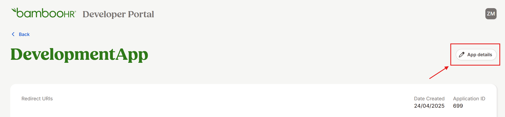
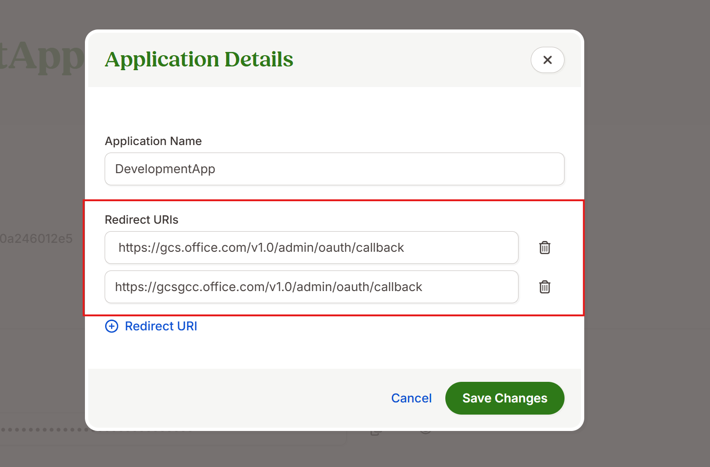
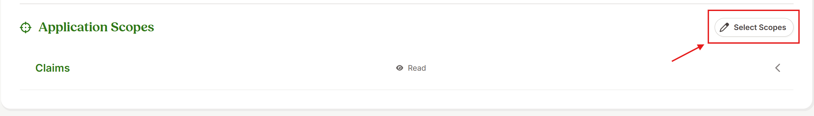
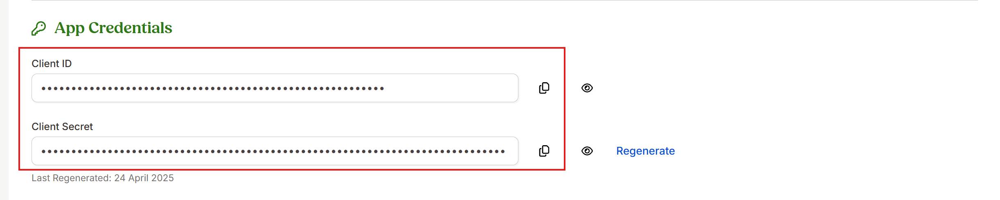

# BambooHR Microsoft Graph connector

With the Microsoft Graph connector, your organization in M365 can index profiles that are accessible to anyone in BambooHR, using Microsoft Copilot and Search. 

This documentation is for Microsoft 365 administrators or anyone who configures, runs, and monitors the BambooHR Microsoft Graph connector. 

## Capabilities

- Access BambooHR profiles using the power of Semantic search
- Customize your crawl frequency 
- Create workflows using this connection and plugins from Microsoft Copilot Studio

## Limitations

- Time off, documents, benefits, trainings, assets, notes, emergency, onboarding, offboarding, and custom properties are not indexable.  

## Prerequisites

Before you create a BambooHR connector, you must:

**1. Setup Application on BambooHR Developer Portal**  

Companies and developers need to work with BambooHR to get access to BambooHR developer portal.

**2. Configure a BambooHR app**  

Configure a BambooHR app with a unique App name 
 

**3. Add direct URLs**

Add the following links into the "Redirect URLs" field in the App details section:   

For M365 Enterprise, copy and paste: https://gcs.office.com/v1.0/admin/oauth/callback 

For M365 Government, copy and paste: https://gcsgcc.office.com/v1.0/admin/oauth/callback 

 
 

**4. Add Application Scopes**  

On the Application Scopes section, select the following scopes with read access only:  

Claims: 

            email, 

            openid, 

Employee: 

            employee, 

            employee:contact, 

            employee:identification, 

            employee:job, 

            employee:management, 

            employee:name, 

            employee_directory, 

            sensitive_employee:address, 

Miscellaneous: 

            app, 

            field, 

            offline_access, 

            public.user, 

            user, 

            user:management, 

Reports: 

            report  

 
 

**5. Get App Client Id and App Secret**

Navigate to the app credentials section to get the App client id and App client secret.   
 

## Get started

### 1. Choose a display name

Choose a display name that helps users easily recognize associated profiles in a Copilot response. 

### 2. Add the instance URL

Enter your BambooHR instance URL e.g., https://contoso.bamboohr.com/ 

### 3. Choose authentication type

Select OAuth 2.0 from list of authentication types, and enter the client id and client secret from BambooHR App portal.

### 4. Roll out to a limited audience

Deploy this connection to a limited user base to validate it in Copilot and other search surfaces before you roll it out to a broader audience.

## Custom setup

Custom setup is not supported for this connector. 

## Troubleshooting

**1. Invalid Credentials. Verify the credential information from BambooHR App**

Ensure that the scopes are correctly configured in the BambooHR App, and verify that the client ID and secret entered match those in the BambooHR App. 

## Next steps

After you publish your connection, you can review the status under the **Data sources** tab in the [admin center](https://admin.microsoft.com). To learn how to make updates and deletions, see [Manage your connector](manage-connector.md).

If you have issues or want to provide feedback, see [Microsoft Graph support](https://developer.microsoft.com/en-us/graph/support).