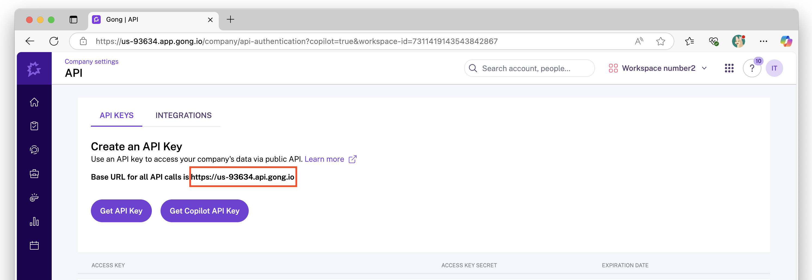
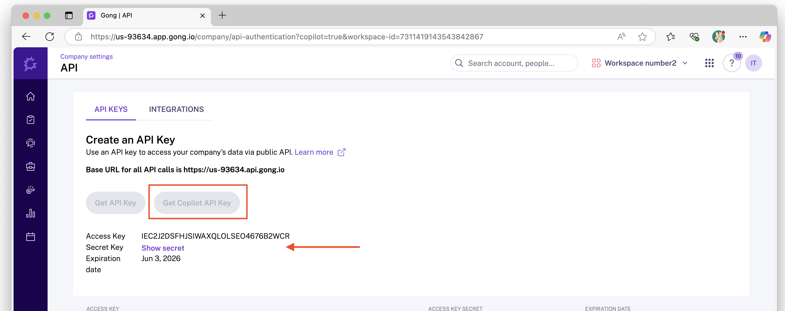
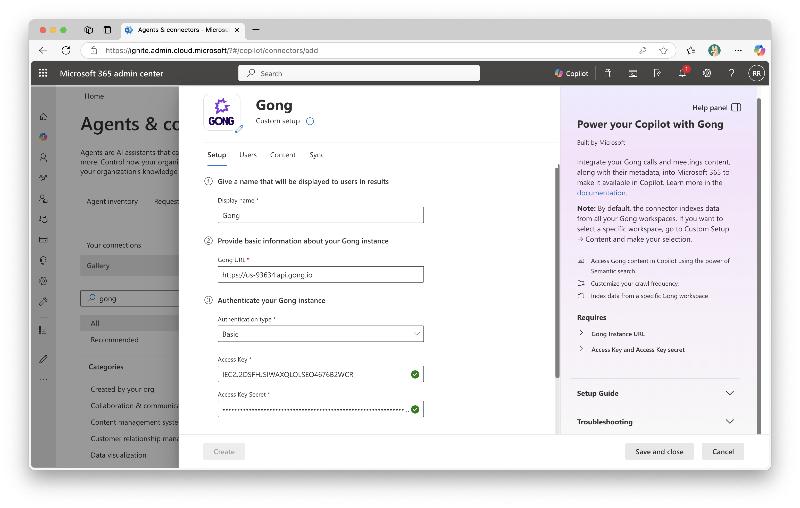
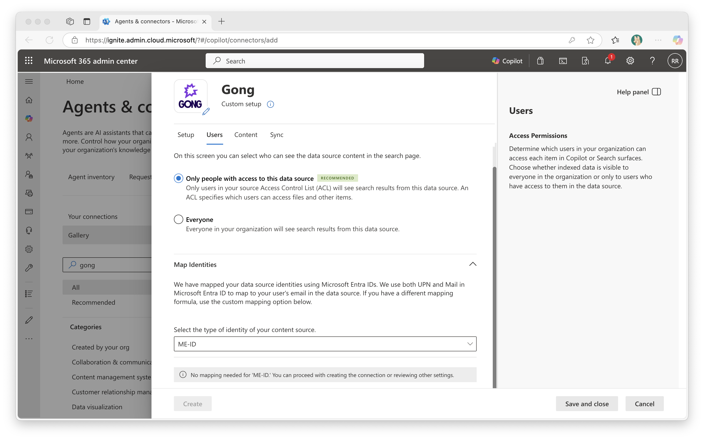
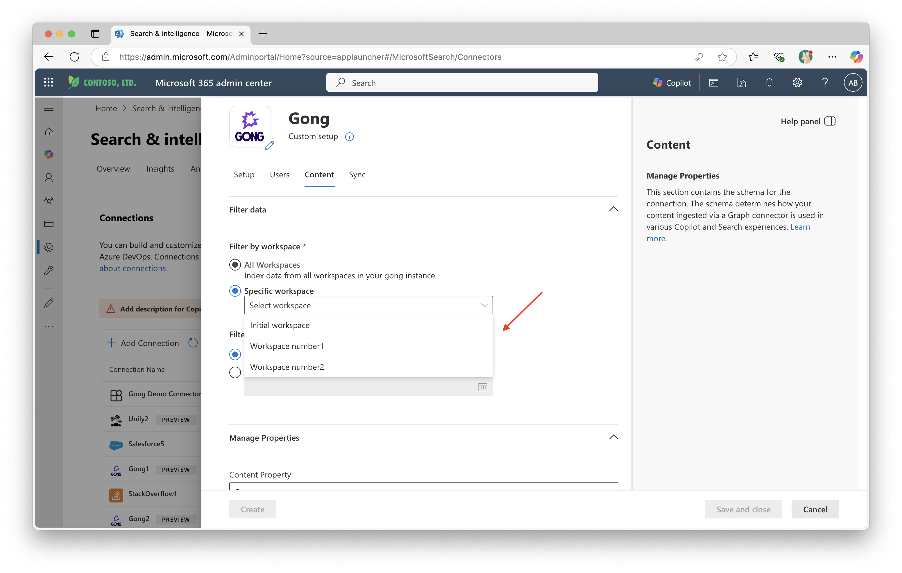
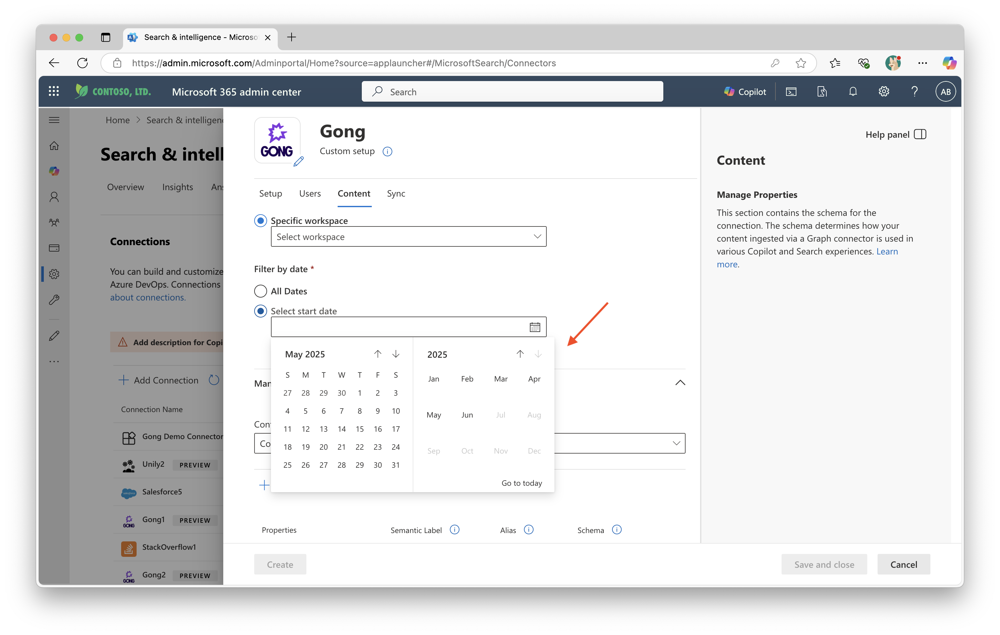
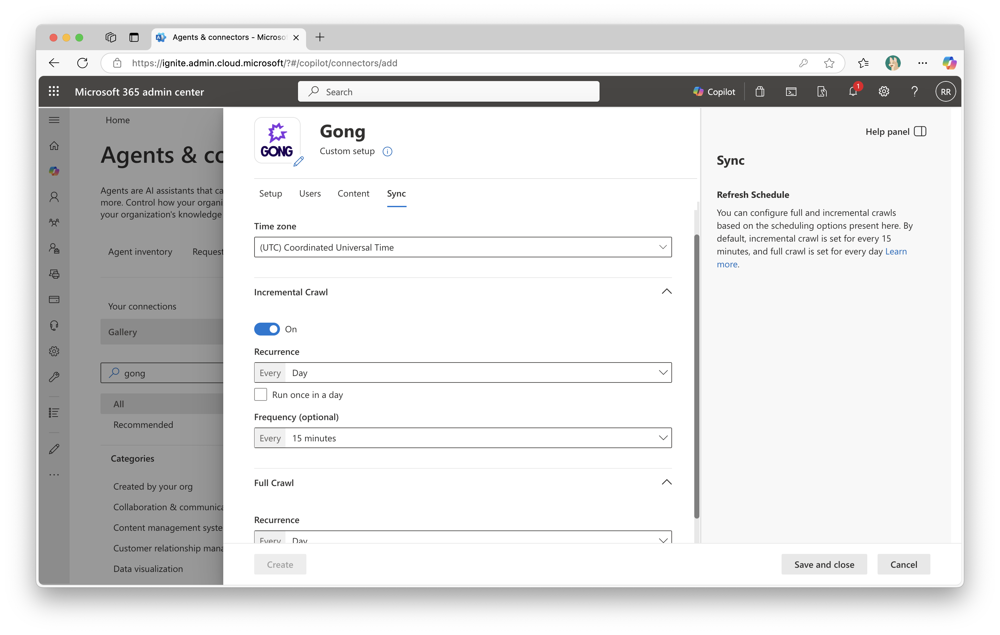

--- 
title: "Gong Copilot connector" 
ms.author: rerabo
author: vivg
manager: harshkum
audience: Admin
ms.audience: Admin 
ms.topic: article 
ms.service: mssearch 
ms.localizationpriority: medium 
search.appverid: 
- BFB160 
- MET150 
- MOE150 
description: "Set up the Gong Copilot connector for Microsoft 365 Copilot and Microsoft Search" 
ms.date: 06/10/2025
---

# Gong Copilot connector (preview)

With the Microsoft Copilot connector for Gong, your organization can index calls and meeting-related content like summaries, action items, and call metadata. The connector enables Gong users to retrieve this information through Microsoft Copilot and any Microsoft Search client.

This article is intended for Microsoft 365 administrators and anyone responsible for configuring, operating, or monitoring the Gong Copilot connector.

## Capabilities
- Index calls and meetings content such as brief, key points, and action items.
- Index calls and meetings metadata, including the title, duration, and basic context from the CRM, such as the Account name and Deal name.
- Enable your end users to ask questions related to Gong directly within Copilot, for example.
    - What are the action items from the Q2 planning meeting with Acme Corp on May 12?
    - What were the key insights from the Demo discussion meeting with Contoso Ltd?
    - What topics come up repeatedly in calls with Fabrikam Inc?
    - Who was the decision maker in the contract review meeting with Northwind Traders?

## Limitations
- Incremental crawl only adds new calls. If an existing call is changed - like being moved to a different workspace, deleted, or trimmed - the updates reflect after a full crawl.
- Private calls aren't crawled: Currently, any calls marked as private in Gong are excluded from indexing.

## Prerequisites
- You must be the search admin for your organization's Microsoft 365 tenant.
- To connect to Gong, you must authenticate using an API key, which includes an Access Key, an Access Key Secret, and the base URL of your Gong instance. Only a Gong administrator can obtain these credentials, which should be generated specifically for the Copilot connector.

Follow the steps below to get the Gong base URL and required credentials for the Copilot connector:

1. Go to https://app.gong.io/company/api-authentication?copilot=true  
   > [!NOTE]
   > The step is equivalent to navigating in Gong to **Settings → Ecosystem → API**, but the URL includes `copilot=true`, which reveals the option to generate a dedicated API key for the Copilot connector.
2. The base URL presented on the screen is used later in the configuration phase of the Gong connector.

3. Click **Get Copilot API Key** and copy the Access key and Access key secret. 

## Get Started

### 1. Display name
A display name is used to identify each reference in Copilot, making it easier for users to recognize the associated file or item. It also indicates that the content is trusted and serves as a [content source filter](/MicrosoftSearch/custom-filters#content-source-filters). While a default value is provided, you can customize the display name to something more familiar and meaningful for users in your organization.

### 2. Gong URL
Enter the Gong base URL that you copied during the [Prerequisites step](#prerequisites).

### 3. Authentication Type
- Select 'Basic'.
- Provide authentication details: Enter the Gong Access key and Access key secret which were created in the [Prerequisites](#prerequisites) section above, to authenticate to your instance.

### 4. Rollout to limited audience
Deploy this connection to a limited user base if you want to validate it in Copilot and other Search surfaces before expanding the rollout to a broader audience. To know more about limited rollout, click [here](staged-rollout-for-graph-connectors.md).

At this stage, you're ready to create the connection to Gong. To proceed, review and agree to the terms by selecting the checkbox next to the **Notice** section.
Then, click the **Create** button. The Copilot connector begins indexing calls and meeting-related content from your Gong instance.

## Custom Setup
Custom setup is intended for admins who want greater control over user access, the content being crawled, and the frequency of data refresh by modifying the default settings. Once you click on the **Custom setup** option, you see three more tabs - Users, Content, and Sync.

>[!NOTE]
> Ensure you authenticate to be able to edit the properties under Users, Content, and Sync.

### Users

#### Access Permissions
The Gong Copilot connector supports search permissions visible to **Only people with access to this data source** (default) or **Everyone**.

If you choose **Only people with access to this data source**, indexed data appears in search results only for users who have access to it in Gong. This means that if a user can access a call in Gong, they see it in Copilot, and if they can’t access a call in Gong, it won’t appear for them in Copilot either.

If you choose **Everyone**, indexed data appears in the search results for all users.

#### Map Identities

To enforce correct permissions, you need to map user identities from Gong to Microsoft Entra ID (ME-ID). There are two options:
1. **Microsoft Entra ID (ME-ID) mapping (default):** 
By default, the system attempts to match users by comparing the **user's email in Gong** with either the **UserPrincipalName** (UPN) or **Mail** attribute in Microsoft Entra ID. This method works when the email addresses align between systems.
2. **Non-Microsoft Entra ID (non ME-ID) mapping (custom):**  
If the default mapping doesn't work for your organization (for example, if email formats differ) you can define a custom mapping formula to link users across systems.

[Click here](map-non-aad.md) to learn more about mapping non-Entra ID identities.

>[!Important]
>- Permission updates only synced in full crawls: 
>Changes to users or groups that govern access permissions are processed during full crawls only. Incremental crawls do not currently capture updates to permissions.
>- Access is based on Gong user profiles:  
>In Copilot, access to calls is determined by the user's profile in Gong. If a call is manually shared with someone who wouldn’t normally have access based on their user profile, they'll not see it in Copilot.
>- Folder-based access is not supported: 
>If a user has access to a call in Gong solely because it resides in a folder with unique permissions (but they lack >access through their Gong profile) they'll not have access to that call in Copilot.

### Filter data

#### Filter by workspace
By default, data is crawled from all Gong workspaces. To limit crawling to a specific workspace, click **Specific workspace**. A dropdown menu will appear, allowing you to select a single workspace for data indexing.

#### Filter by date
By default, data is crawled from all available dates. To limit the crawl to more recent content, you can select a specific start date by clicking the **Select start date** option.

### Sync
The refresh interval determines how often your data is synced between the data source and the Copilot connector index. There are two types of refresh intervals: full crawl and incremental crawl. For more details, click [here](configure-connector.md#guidelines-for-sync-settings).
You can change the default refresh interval values from here if needed.

