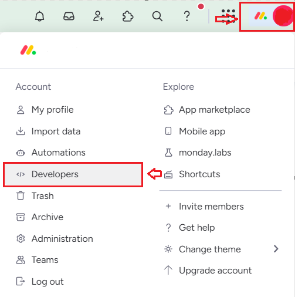
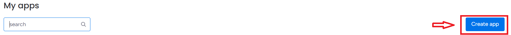
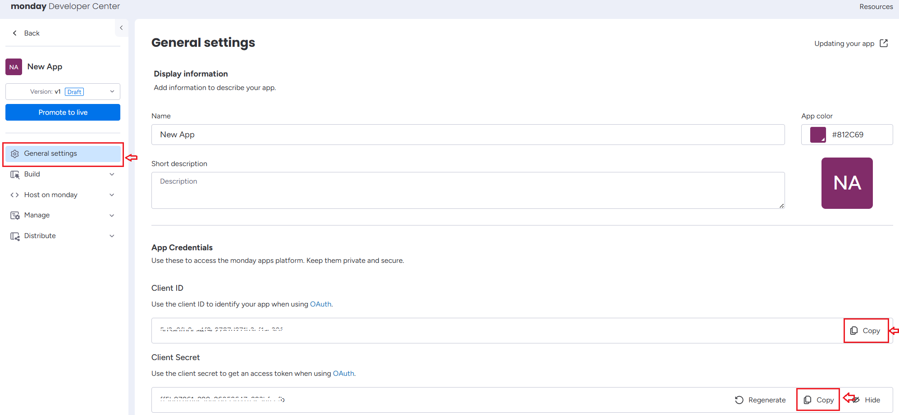
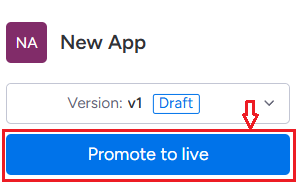
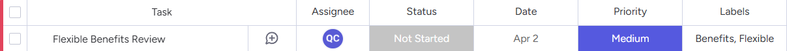

--- 
title: "Monday.com  Microsoft 365 Copilot connector (preview)" 
ms.author: rantang
author: ranran1998
manager: jecui
audience: Admin
ms.audience: Admin 
ms.topic: install-set-up-deploy
ms.service: mssearch 
ms.localizationpriority: Medium 
search.appverid: 
- BFB160 
- MET150 
- MOE150 
description: "Set up the Monday.com  Microsoft 365 Copilot connector." 
ms.date: 05/15/2025
---
# Monday.com  Microsoft 365 Copilot connector (preview)

The Monday.com  Microsoft 365 Copilot connector enables organizations to index board content from Monday.com into Microsoft Graph, making it accessible across Microsoft 365 experiences, including Microsoft 365 Copilot and Microsoft Search.

The connector integrates the Monday.com permission model to ensure that users only access authorized content. It enhances productivity by enabling better task discovery, automated workflows, and AI-assisted project tracking. By indexing Monday.com data, the connector helps teams streamline collaboration and improve decision-making across projects.

## Key Benefits

- **Enhanced searchability of work items:** Enables Microsoft Search to retrieve Monday.com boards, groups, and items efficiently.
- **AI-assisted project management:** Uses Copilot to summarize, track, and generate updates for tasks.
- **Seamless content indexing:** Captures metadata, task descriptions, and key attributes from Monday.com.
- **Maintains permissions and compliance:** Respects the Monday.com built-in ACLs to ensure access control.

## Capabilities

The Monday.com connector enables:

- **Project & task indexing:** Makes Monday.com boards, groups, and items searchable across Microsoft 365.
- **AI-powered insights:** Enhances workflows with intelligent recommendations based on indexed task data.
- **Summarization & tracking:** Generates summaries of pending tasks, overdue work, and key updates.
- **User-permission enforcement:** Maintains the Monday.com permission settings to restrict access to authorized users.
- **Metadata indexing:** Captures task priority, status, due dates, assignees, and related attributes.
- **Custom filtering:** Allows indexing by workspace.

## Limitations

- Indexes only active boards, groups, and tasks.
- Does not index attachments or comments.

## Prerequisites  

### Configure OAuth APP in Monday.com  

1. Log in your Monday.com account and go to the **Monday.com Developer Center**
   
   

2. Click **Create app**.

     
 
3. In the **General Settings** section, locate and note down your **Client ID** and **Client secret**.

     

4. In the **Build** section, open the **OAuth & permission** tab, click the **Scopes** subtab and **enable all read permissions**.

     
 
5. Go to the **Redirect URLs** subtab and enter the following redirect URLs and click **Save Scopes**. 

   - **For Microsoft 365 Enterprise**, copy and paste: `https://gcs.office.com/v1.0/admin/oauth/callback`.  
   - **For Microsoft 365 Government**, copy and paste:  `https://gcsgcc.office.com/v1.0/admin/oauth/callback`.

   

6. Click **Promote to Live** to activate the app.

   

## Get started

### 1. Choose display name
Choose a display name that helps users recognize merge requests, issues, or documentation in a Copilot response.

### 2. Monday.com Instance URL
Enter the instance URL of your Monday.com instance (for example, `https://test-instance.monday.com`). 

### 3. Authenticate

- Enter your **Client ID** and **Client secret** from Monday.com.
- Choose **Authorize** to sign in and grant access.
- Grant the required API scopes.

### 4. Roll out to limited audience

Deploy this connection to a limited user base if you want to validate it in Copilot and other Search surfaces before expanding the rollout to a broader audience.

To create the connection for your Monday.com instance, click **Create* to publish your connection and index items from your Monday.com instance.  

For other settings, like Access Permissions, Data inclusion rules, Schema, Crawl frequency, etc., we set defaults based on what works best with Monday.com items. The default values settings are as follows.

|Page|Settings|Default values|
|--- | ---- | ---|
|Users | Access permissions | Only people with access to this data source.|
|Users | Map Identities |Data source identities mapped using Microsoft Entra IDs.|
|Content | Index content | All cards, except the cards in personal space. |
|Content | Manage properties | To check default properties and their schema, see [Content](#content).|
|Sync | Incremental crawl | Frequency: Every 4 hours.|
|Sync | Full crawl | Frequency: Every day.|

If you want to edit any of these values, you need to choose the **Custom setup** option. 

## Custom setup
Custom setup is for admins who want to edit the default values for any settings. When you choose **Custom setup**, you see three other tabs: **Users**, **Content**, and **Sync**. 

### Users
#### Access permissions

The Monday.com Copilot connector supports data visible to Only people with access to this data source (recommended) or Everyone. If you choose Everyone, indexed data appears in the search results for all users. 

#### Identity mapping
To ensure correct permission enforcement, map Monday.com user identities to Microsoft Entra ID. The following are the options:

To identify which option is suitable for your organization: 

1. Choose the **Microsoft Entra ID** option if the email ID of Monday.com users is same as the UserPrincipalName (UPN) of users in Microsoft Entra ID. 

2. Choose the **non-AAD** option if the email ID of Monday.com users is **different** from the UserPrincipalName (UPN) of users in Microsoft Entra ID.

>[!Important]
>- If you choose Microsoft Entra ID as the type of identity source, the connector maps the email IDs of users obtained from Monday.com directly to UPN property from Microsoft Entra ID.
>- If you chose "non-AAD" for the identity type see Map your non-Azure AD Identities for instructions on mapping the identities. You can use this option to provide the mapping regular expression from email ID to UPN.
>- Updates to users or groups governing access permissions are synced in full crawls only. Incremental crawls do not currently support the processing of updates to permissions.


### Content
On the **Content** tab, you can verify property mappings in the sample data for metadata such as **content**, **labels**, **description**, and **timestamps**.

#### Content ingestion filters   

You can choose what data you want to index. Use the regex expression of WorkSpaces to select your data before it is indexed, allowing you to control what data is searchable. Following are some examples to illustrate how to use regex expressions to select specific workspace(s).

| Scenario                                   | Example workspace name(s)               | Regex expression                                 | Notes                                                                 |
|--------------------------------------------|------------------------------------------|--------------------------------------------------|-----------------------------------------------------------------------|
| Exact match for a single workspace         | `workspace1`                             | <code>^workspace1$</code>                        | Exact match of `workspace1`                                          |
| Fuzzy match for a single workspace         | `team-marketing-q1`                      | `.*marketing.*`                    | Matches any workspace that contains "marketing" in the name          |
| Exact match for multiple workspaces        | `workspace1`, `workspace2`               | <code>^(workspace1&#124;workspace2)$</code>      | Matches exactly `workspace1` or `workspace2`                         |
| Fuzzy match for multiple workspaces        | `workspace-marketing`, `workspace-sales` | <code>^workspace-[a-z]+$</code>                  | Matches any workspace starting with `workspace-` and letters         |
| Fuzzy match for multiple keywords in name  | `workspace-engineering`, `workspace-sales-q4` | `.*(eng|sales).*`       | Matches workspaces containing `eng` or `sales` in the name           |

Use the preview results button to verify the sample values of the selected properties and filters. 

#### Manage properties

Here, you can check available properties from your Monday.com instance. Assign a schema to the property (define whether a property is searchable, queryable, retrievable, or refinable), review the semantic label, and add an alias to the property. Properties that are selected by default are listed below. 

| Property             | Semantic Label       | Description                                     | Schema            |
|----------------------|----------------------|------------------------------------------------|-----------------------|
| BoardDescription     | None                 | Description of the board.                        | Retrieve, Search.      |
| BoardID              | None                 | Unique identifier for the board.                 | Query, Retrieve.       |
| BoardName            | None                 | Name of the board.                               | Query, Retrieve, Search.|
| BoardUrl             | None                 | URL link to the board.                           | Retrieve.              |
| Content              | `CONTENT`            | Merge all columns and corresponding values of the item.   | Search.  |
| CreatedBy            | `Created by`         | User who created the item.                     | Query, Retrieve.  |
| CreatedDateTime      | `Created date time`  | Timestamp when the item was created.            | Query, Retrieve.    |
| GroupID              | None                 | Unique identifier for the group.    | Query, Retrieve.       |
| GroupName            | None                 | Name of the group.         | Query, Retrieve, Search.|
| LastModifiedDateTime | `Last modified date time` | Timestamp of the last modification.          | Query, Retrieve.  |
| Title                | `Title`              | Title of the task item.                        | Query, Retrieve, Search.|
| URL                  | `url`                | URL related to the item.                         | Retrieve.              |
| WorkspaceDescription | None                 | Description of the workspace.                    | Retrieve, Search.      |
| WorkspaceID          | None                 | Unique identifier for the workspace.             | Query, Retrieve.       |
| WorkspaceName        | None                 | Name of the workspace.                            | Query, Retrieve, Search.|


**Description of `Content` property:**  
The Content field contains a JSON object that represents all the columns and their corresponding values for a given item. Each key in the JSON object corresponds to a column name (such as Assignee or Status), and each value holds the specific data for that item. Below is an example illustrating how the item and its Content field are structured.



```json
{
  "Assignee": "QC",
  "Status": "Not Started",
  "Date": "Apr 2",
  "Priority": "Medium",
  "Labels": "Benefits, Flexible"
}
```

### Sync
You can configure full and incremental crawls based on the scheduling options present here. By default, incremental crawl is set for every 4 hours, and full crawl is set for every day. If needed, you can adjust these schedules to fit your data refresh needs.

## Troubleshooting
After publishing your connection, you can review the status in the **Agents and connectors** section of the [admin center](https://admin.microsoft.com). To learn how to make updates and deletions, see [Manage your connector](manage-connector.md).

If you have issues or want to provide feedback, contact [Microsoft Graph | Support](https://developer.microsoft.com/graph/support).
