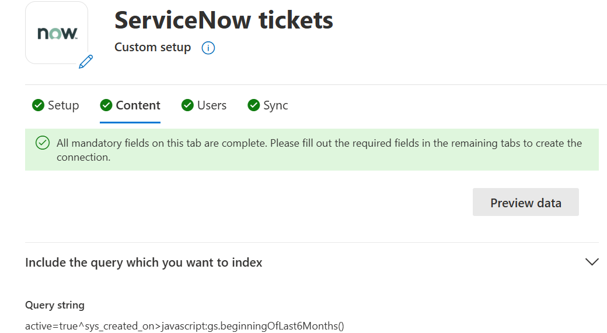
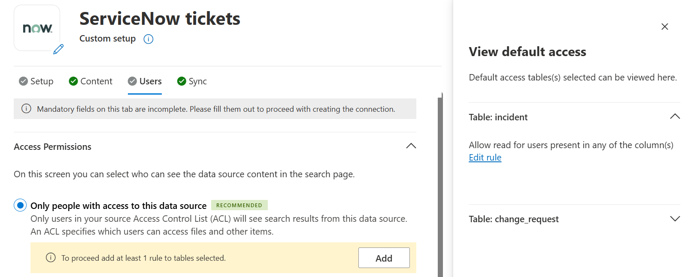
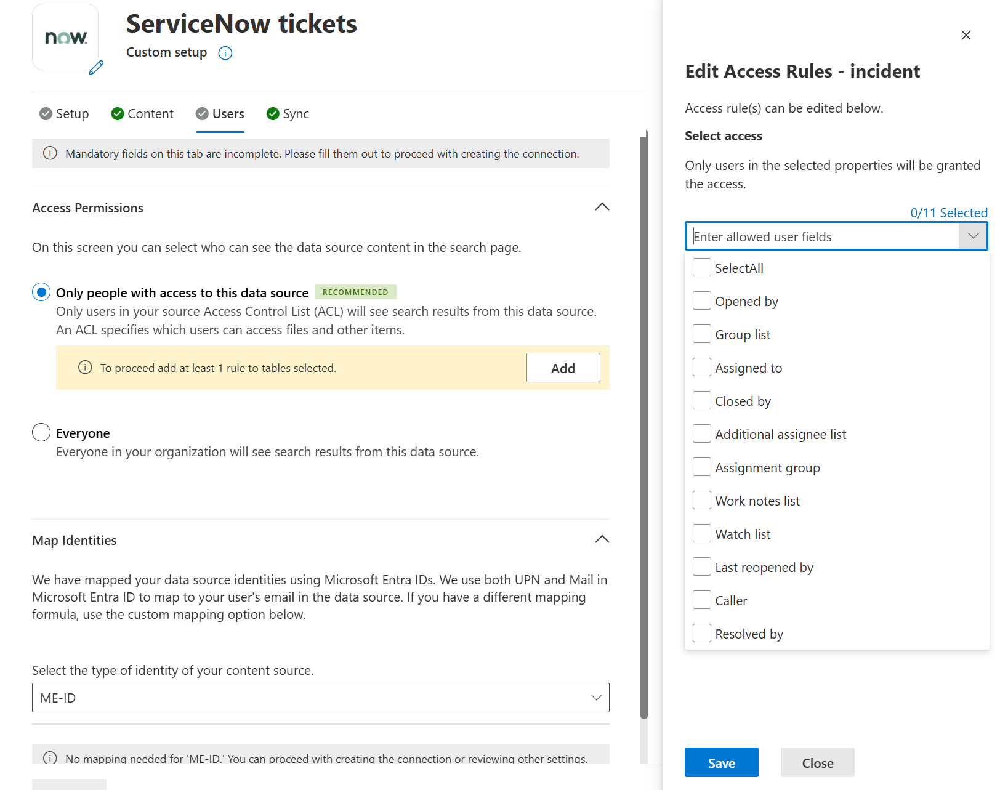

# ServiceNow Tickets Microsoft 365 Copilot connector

With the ServiceNow Tickets Microsoft 365 Copilot connector, your organization can index various tickets that are serviced to users. After you configure the connector and index content from ServiceNow, end users can search for those tickets from any Microsoft Search and Microsoft 365 Copilot client.  

This article is for Microsoft 365 administrators or anyone who configures, runs, and monitors a ServiceNow Tickets Copilot connector. It supplements the general instructions provided in the [Set up Microsoft Graph connectors in the Microsoft 365 admin center](configure-connector.md) article. 

Each step in the setup process is listed below, along with either a note that indicates you should follow the general setup instructions or other instructions that apply to only the ServiceNow Copilot connector, including information about [Troubleshooting](#troubleshooting) and [Limitations](#limitations).  

## Prerequisites

***ServiceNow Instance URL:*** To connect to your ServiceNow data, you need your organization's ServiceNow instance URL. Your organization's ServiceNow instance URL typically looks like **https://&lt;your-organization-domamin>.service-now.com**. (Do not have one? [Check how to create a test instance](https://www.youtube.com/watch?v=OTdzVLqpFHY))

***Service Account:*** For the connector setup, you will need a service account to set up the connection to ServiceNow and to allow Microsoft Search and Microsoft 365 Copilot to periodically update the ticket details based on the refresh schedule. 

***Table Access:*** In ServiceNow, the task table is the base class for ticket management. It can be extended to create ticket applications such as incident, problem, and change management. Learn more about [ServiceNow Task tables](https://docs.servicenow.com/bundle/washingtondc-platform-administration/page/administer/task-table/concept/c_TaskTable.html). 

> [!Note]
> Crawling is done on the child tables that you have selected for ingestion and the task table.

The service account you use to configure the tickets connection **must have** read access to the following ServiceNow table records to successfully crawl default ticket fields. 

**Feature** | **Read access required tables** | **Description**
--- | :---: | ---
Index base [Task table fields](https://docs.servicenow.com/bundle/sandiego-platform-administration/page/administer/task-table/reference/r_ImportantTaskTableFields.html#r_ImportantTaskTableFields) | `task` | For crawling default fields from out of the box task tables
Sync user tables | `sys_user` | To index user access details for tickets
| | `sys_user_has_role` | Read role information of users
| | `sys_user_grmember` | Read group membership of users
| | `sys_user_group` | Read user group segments
| | `sys_user_role` | Read user roles
| | `cmn_location` | Read location information
| | `cmn_department` | Read department information
| | `core_company` | Read company attributes

If you want to index custom properties from [extended tables](https://docs.servicenow.com/bundle/washingtondc-application-development/page/administer/table-administration/concept/table-extension-and-classes.html) of *task* table, provide read access to these tables : ***sys_dictionary*** and ***sys_db_object***. It is an **optional** feature. You'll be able to index *task* table properties without access to the two extra tables.

**Feature** | **Read access required tables** | **Description**
--- | :---: | ---
Index custom fields from a specific table | `sys_dictionary` | Crawling custom fields from a specific table like incident, problem or change_management
Select a custom table from your organization| `sys_db_object` | Find the list of extended task tables, including custom tables

You can **create and assign a role** for the service account you use to connect with Microsoft Search and Microsoft 365 Copilot. [Learn how to assign role for ServiceNow accounts](https://docs.servicenow.com/bundle/washingtondc-platform-administration/page/administer/users-and-groups/task/t_AssignARoleToAUser.html). Read access to the tables can be provided to the created role. To learn about setting read access to table records, see [Securing Table Records](https://developer.servicenow.com/dev.do#!/learn/learning-plans/sandiego/new_to_servicenow/app_store_learnv2_securingapps_sandiego_securing_table_records). When providing read access to sys_db_object, you should create two Access Control Lists: one for row access and one for field access.

## Get Started: Steps to setup the ServiceNow Tickets Copilot connector

## Step 1: Select the ServiceNow Tickets Copilot connector in the Microsoft 365 admin center. 

[Add the ServiceNow Tickets Copilot connector](https://admin.microsoft.com/adminportal/home#/MicrosoftSearch/Connectors/add?ms_search_referrer=MicrosoftSearchDocs_ServiceNowTickets&type=ServiceNowTickets​) The connector setup page that opens has 4 sections – **Setup**, **Content**, **Users**, and **Sync**. First, you would need to provide the details for **Setup** & authorize the connection (covered in steps 2 to 4 below) before proceeding to configure the **Content**, **Users** & **Sync** (optional) & then finally create the connection. 

## Step 2: [Setup] Provide “Display Name”
A display name is used to identify each reference in Copilot, helping users easily recognize the associated file or item. Display name also signifies trusted content. Display name is also used as a [content source filter](/MicrosoftSearch/custom-filters#content-source-filters). A default value is present for this field, but you can customize it to a name that users in your organization recognize. 

## Step 3: [Setup] ServiceNow URL

To connect to your ServiceNow data, you need your organization's ServiceNow instance URL. Your organization's ServiceNow instance URL typically looks like `https://your-organization-name.service-now.com`.

## Step 4: [Setup] Authentication Type 

To authenticate and sync content from ServiceNow, choose **one of three** supported methods:

- Basic authentication
- **ServiceNow OAuth (recommended)**
- Microsoft Entra ID OpenID Connect

### Step 4.1: Basic authentication

Enter the username and password of the ServiceNow account with read access to the `task` and `sys_user` tables to authenticate to your instance.

### Step 4.2: ServiceNow OAuth
<br/>
<details>
   <summary>[Click to expand] To use ServiceNow OAuth for authentication, follow these steps.</summary>
   <br/>
   
   A ServiceNow admin needs to provision an endpoint in your ServiceNow instance, so that the ServiceNow Knowledge Copilot connector can access it. To learn more, see [Create an endpoint for clients to access the instance](https://docs.servicenow.com/bundle/xanadu-platform-security/page/administer/security/task/t_CreateEndpointforExternalClients.html) in the ServiceNow documentation.

The following table provides guidance on how to fill out the endpoint creation form:

Field | Description | Recommended Value
--- | --- | ---
Name | Unique value that identifies the application that you require OAuth access for. | Microsoft Search
Client ID | A read-only, auto-generated unique ID for the application. The instance uses the client ID when it requests an access token. | NA
Client secret | With this shared secret string, the ServiceNow instance and Microsoft Search authorize communications with each other. | Follow security best practices by treating the secret as a password.
Redirect URL | A required callback URL that the authorization server redirects to. | For **M365 Enterprise**: https://<span>gcs.office.</span>com/v1.0/admin/oauth/callback,</br> For **M365 Government**: https://<span>gcsgcc.office.<span>com/v1.0/admin/oauth/callback
Logo URL | A URL that contains the image for the application logo. | NA
Active | Select the check box to make the application registry active. | Set to active
Refresh token lifespan | The number of seconds that a refresh token is valid. By default, refresh tokens expire in 100 days (8,640,000 seconds). | 31,536,000 (one year)
Access token lifespan | The number of seconds that an access token is valid. | 43,200 (12 hours)

Enter the client ID and client secret to connect to your instance. After connecting, use a ServiceNow account credential to authenticate permission to crawl. The account should at least have read access to `task` and `sys_user` tables. Refer to the table mentioned under the [Prerequisites](#prerequisites) section for providing read access to more ServiceNow table records and index user criteria permissions.
<a name='step-33-azure-ad-openid-connect'></a>
</details>

### Step 4.3: Microsoft Entra ID OpenID Connect
<br/>
<details>
   <summary>[Click to expand] To use Microsoft Entra ID OpenID Connect for authentication, follow the steps below.</summary>
   <br/>
<a name='step-431-register-a-new-application-in-azure-active-directory'></a>

### Step 4.3.1 : Register a new application in Microsoft Entra ID

To learn about registering a new application in Microsoft Entra ID, see [Register an application](/azure/active-directory/develop/quickstart-register-app#register-an-application). Select single tenant organizational directory. Redirect URL isn't needed. After registration, note down the **Application (client) ID** and **Directory ID (Tenant ID)**.

### Step 4.3.2: Create a client secret

To learn about creating a client secret, see [Creating a client secret](/azure/active-directory/develop/quickstart-register-app#add-a-client-secret). Take note of client secret value.

### Step 4.3.3: Retrieve Service Principal Object Identifier

Follow the steps to retrieve Service Principal Object Identifier

1. Run PowerShell.

2. Install Azure PowerShell using the following command.

   ```powershell
   Install-Module -Name Az -AllowClobber -Scope CurrentUser
   ```

3. Connect to Azure.

   ```powershell
   Connect-AzAccount
   ```

4. Get Service Principal Object Identifier.

   ```powershell
   Get-AzADServicePrincipal -ApplicationId "Application-ID"
   ```
   Replace "Application-ID" with the Application (client) ID (without quotes) of the application you registered in step 4.3.1. Note the value of ID object from PowerShell output. It is the **Service Principal ID**.

Now you have all the information required from the Azure portal. A quick summary of the information is given in the table below.

Property | Description
--- | ---
Directory ID (Tenant ID) | Unique ID of the Microsoft Entra tenant, from step 4.3.1.
Application ID (Client ID) | Unique ID of the application registered in step 4.3.1.
Client Secret | The secret key of the application (from step 4.3.2). Treat it like a password.
Service Principal ID | An identity for the application running as a service. (from step 4.3.3)

### Step 4.3.4: Register ServiceNow Application

The ServiceNow instance needs the following configuration:

1. Register a new OAuth OIDC entity. To learn, see [Create an OAuth OIDC provider](https://docs.servicenow.com/bundle/washingtondc-platform-security/page/administer/security/task/add-OIDC-entity.html).

2. The following table provides guidance on how to fill out OIDC provider registration form

   Field | Description | Recommended Value
   --- | --- | ---
   Name | A unique name that identifies the OAuth OIDC entity. | Microsoft Entra ID
   Client ID | The client ID of the application registered on the third-party OAuth OIDC server. The instance uses the client ID when requesting an access token. | Application (Client) ID from step 4.3.1
   Client Secret | The client secret of the application registered in the third-party OAuth OIDC server. | Client Secret from step 4.3.2

   All other values can be default.

3. In the OIDC provider registration form, you need to add a new OIDC provider configuration. Select the search icon against *OAuth OIDC Provider Configuration* field to open the records of OIDC configurations. Select New.

4. The following table provides guidance on how to fill out OIDC provider configuration form

   Field | Recommended Value
   --- | ---
   OIDC Provider |  Microsoft Entra ID
   OIDC Metadata URL | The URL must be in the form https\://login.microsoftonline.com/<tenandId">/.well-known/openid-configuration <br/>Replace "tenantID" with Directory ID (Tenant ID) from step 4.3.1
   OIDC Configuration Cache Life Span |  120
   Application | Global
   User Claim | sub
   User Field | User ID
   Enable JTI claim verification | Disabled

5. Select Submit and Update the OAuth OIDC Entity form.

### Step 4.3.5: Create a ServiceNow account

Refer the instructions to create a ServiceNow account, [create a user in ServiceNow](https://docs.servicenow.com/bundle/washingtondc-platform-administration/page/administer/users-and-groups/task/t_CreateAUser.html).

The following table provides guidance on how to fill out the ServiceNow user account registration

Field | Recommended Value
--- | ---
User ID | Service Principal ID from step 4.3.3
Web service access only | Checked

All other values can be left to default.

### Step 4.3.6: Enable Task, User table access for the ServiceNow account

Access the ServiceNow account you created with ServiceNow Principal ID as User ID and assign the read access to `task` and `sys_user` table. Instructions to assign a role to a ServiceNow account can be found here, [assign a role to a user](https://docs.servicenow.com/bundle/xanadu-platform-administration/page/administer/users-and-groups/task/t_AssignARoleToAUser.html) Refer to the table mentioned under the [Prerequisites](#prerequisites) section for providing read access to more ServiceNow table records and index custom fields.

Use Application ID as Client ID (from step 4.3.1), and Client secret (from step 4.3.2) in the M365 admin center configuration window to authenticate to your ServiceNow instance using Microsoft Entra ID OpenID Connect.
</details>

Once all the details are entered as per any of the above authentication types, click on "**Authorize**". But before we publish the connection, we need to set up the **Content** & **Users** as well for the connector. As part of the custom setup, you can also choose to configure the **Sync** details (optional) for the connector. 

## Step 5: [Content] Filter

With a ServiceNow query string, you can specify conditions for syncing tickets. It is like a **Where** clause in a **SQL Select** statement. For example, if you choose to index only tickets that are created in the last six months, then you can provide the query as: `sys_created_on>javascript:gs.beginningOfLast6Months()`. To learn about creating your own query string, see [Generate an encoded query string using a filter](https://docs.servicenow.com/bundle/washingtondc-platform-user-interface/page/use/using-lists/task/t_GenEncodQueryStringFilter.html).

## Step 6: [Content] Tables

In this step, you can add or remove available tables from your ServiceNow data source. Microsoft 365 has already selected the “**incident**” table by default. You can choose to select more tables from the dropdown provided in this section. 

## Step 7: [Content] Manage Properties  

Here, you can add or remove available properties that you want to index from the source tables selected from your ServiceNow data source. Additionally,
- you can define the schema for the property (define whether a property is searchable, queryable, retrievable, or refinable), Learn more about schema attributes [here](configure-connector.md#search-schema-attributes) 
- change the semantic label, if needed. Know more about semantic labels [here](configure-connector.md#semantic-labels-for-source-properties) 
- add an alias to the property to enhance search relevance. Learn more about aliases [here](configure-connector.md#aliases-for-source-properties)  

*The list of properties that you select here can impact how you can filter, search, and view your results in Microsoft 365 Copilot.* By default, Microsoft ServiceNow Tickets Copilot connector indexes the following properties: 

**Source property** | **Semantic Label** | **Description**
:---: | :---: | ---
AccessUrl  | `url` | The target URL of the item in the data source.
AssignedTo | | Name of the person to whom the item is assigned 
Description `[Content]` | | Description for the item 
EntityType | | Entity Type of the item such as incidents, change request, etc.  
IconUrl   | `IconUrl` | Icon URL that represents the article’s category or type. 
OpenedBy   | `Authors` | Name of people who participated/collaborated on the item in the data source.
ShortDescription   | `Title` | The title of the item that you want to be shown in search and other experiences.
SysCreatedBy   | `Created by` | Name of the person who created the item in the data source.
SysCreatedOn   | `Created date time` | Date and time that the item was created in the data source.
SysUpdatedBy   | `Last modified by` | Name of the person who most recently edited the item in the data source.
SysUpdatedOn  | `Last modified date time` | Date and time the item was last modified in the data source.

## Step 8: [Content] Preview Data

Use the preview results button shown at the top of the content page to verify the sample values of the selected properties and query filter. 
<p align="center">

</p>

## Step 9: [Users] Access Permissions 

The ServiceNow Tickets Copilot connector supports search permissions visible to “**Only people with access to this data source**”.

- Select “**Only people with access to this data source**” under Access Permissions
- Provide at least one rule for all the tables that you have selected for indexing. For each of the tables that appear in the side panel, click on the expand down arrow & then click on “**Edit rule**”.
  <p align="center">
  
  </p>
- For each table selected, you can allow “**read**” permissions for users by selecting the allowed user fields from the dropdown list. Indexed ticket items are visible to only users who have access to them via any of the column fields that you may select, like Assigned to, Opened by, Closed by, etc.
  <p align="center"> 
  
  </p>

- Do the same for the tables that you have selected to index.

## Step 10: [Users] Map Identities 

Next, you need to further choose whether your ServiceNow instance has Microsoft Entra ID provisioned users or non-Azure AD users. To identify which option is suitable for your organization:

1. Choose the default mapping option of “**Microsoft Entra ID**” if the email ID of ServiceNow users is the **same** as the UserPrincipalName (UPN), or Mail of the users in Microsoft Entra ID.
2. If you believe the default mapping would not work for your organization, choose the “**Non-Azure AD**” option if the email ID of ServiceNow users is **different** from the UserPrincipalName (UPN) of users in Microsoft Entra ID. You can provide a custom mapping formula. To know more about mapping Non-EntraID identities, click [here](map-non-aad.md).

>[!NOTE]
> * If you choose Microsoft Entra ID as the type of identity source, the connector maps the email IDs of users obtained from ServiceNow directly to UPN property from Microsoft Entra ID.
> * If you chose "Non-Azure AD" for the identity type see [Map your non-Azure AD Identities](map-non-aad.md) for instructions on mapping the identities. You can use this option to provide the mapping regular expression from email ID to UPN.
> * Updates to users or groups governing access permissions are synchronized only during periodic full crawls. Incremental crawls do not currently support the processing of updates to item permissions or group membership updates.

## Step 11: [Sync] Define incremental & full crawl frequencies - [optional]

The refresh interval determines how often your data is synchronized between the data source and the ServiceNow Tickets Copilot connector index. There are two types of refresh intervals:  
- Full crawl: Synchronizes all data at scheduled intervals.
- Incremental crawl: Updates only the changed or new data. 

You can change the default values of the refresh interval from here if you want to or just continue with the recommended defaults. For more details, click [here](configure-connector.md#sync). 

You can see the default values below: 

**Refresh Intervals** | **Default frequency** 
:---: | :---:
Incremental Crawl  | Every 15 min
Full Periodic Crawl  | Every day

>[!NOTE]
> * Identities or access permissions are only updated with full crawl.
> * Incremental crawls do not update permissions or ACLs. 

## Step 12: [Setup] Rollout to a limited audience.

Deploy this connection to a limited user base if you want to validate it in Copilot and other Search surfaces before expanding the rollout to a broader audience. To know more about limited rollout, click [here](staged-rollout-for-graph-connectors.md).

At this point, you are ready to create the connection for ServiceNow Knowledge. You can select the **Create** button, and the ServiceNow Knowledge Copilot connector will now start indexing articles from your ServiceNow account. 

After publishing the connection, you need to customize the search results page. To learn about customizing search results, see [Customize the search results page](/microsoftsearch/configure-connector#next-steps-customize-the-search-results-page).

## Limitations
The ServiceNow Tickets Copilot connector has the following limitations in its latest release:

- Under the Access permissions step in Users tab, “***Everyone***” feature does not process any permissions. Do not select this option unless you want to test the connection between selected team members in an isolated environment.
- Access permissions do not allow defining role-based ACLs 

## Troubleshooting
After publishing your connection and customizing the results page, you can review the status under **Data Sources** in the [admin center](https://admin.microsoft.com). To learn how to make updates and deletions, see [Manage your connector](manage-connector.md).
You can find troubleshooting steps for commonly seen issues [here](troubleshoot-servicenow-tickets-connector.md).
